```mermaid
graph TD
    subgraph FRONTEND LAYER
        direction LR
        A1["User enters spiritual question in web form<br>(index.html)"]
        A2["User selects:<br>- Reading style (Deep/Balanced/Broad)<br>- LLM model<br>- Admin parameters (if enabled)<br>(frontend/js/reading-styles.js)"]
        A3["JavaScript constructs API request:<br>POST /ask<br>(frontend/js/main.js)"]
        A1 --> A2 --> A3
    end

    subgraph API LAYER
        direction LR
        B1["FastAPI /ask endpoint receives POST request<br>(api/spiritual_api.py)"]
        B2["Request validation and logging<br>(api/spiritual_api.py)"]
        B3["Parameter extraction<br>(api/spiritual_api.py)"]
        B4["Get answer generator for specified model<br>(api/spiritual_api.py)"]
        B1 --> B2 --> B3 --> B4
    end

    subgraph DOCUMENT RETRIEVAL LAYER
        direction LR
        C1["Initialize DocumentRetriever with vector DB<br>(utils/document_retriever.py)"]
        C2["Convert question to embedding vector<br>(utils/query_utils.py)"]
        C3["Choose retrieval strategy based on reading_style<br>(utils/document_retriever.py)"]
        C1 --> C2 --> C3

        subgraph Retrieval Strategies
            direction TD
            C4_1["Deep: similarity_search()"] --> C5
            C4_2["Balanced: mmr_search() (mid diversity)"] --> C5
            C4_3["Broad: mmr_search() (high diversity)"] --> C5
        end
        C3 --> C4_1
        C3 --> C4_2
        C3 --> C4_3

        C5["Process and rank retrieved docs<br>(utils/document_retriever.py)"]
        C6["Format retrieved chunks to context<br>(utils/document_retriever.py)"]
        C7["Prepare final context string for LLM<br>(document_retriever.py)"]
        C5 --> C6 --> C7
    end

    subgraph ANSWER GENERATION LAYER
        direction LR
        D1["Select prompt template by query type<br>(prompts/answer_prompts.py)"]
        D2["Construct final prompt with context<br>(answer_generator.py)"]
        D3["Determine LLM API to call based on model<br>(utils/llm_integrations.py)"]
        D4["Call LLM API<br>(utils/llm_integrations.py)"]
        D5["Process LLM response<br>(answer_generator.py)"]
        D6["Format final response with sources<br>(answer_generator.py)"]
        D1 --> D2 --> D3 --> D4 --> D5 --> D6
    end

    subgraph RESPONSE LAYER
        direction LR
        E1["Create API response object<br>(api/spiritual_api.py)"]
        E2["Return JSON response to frontend<br>(api/spiritual_api.py)"]
        E3["Frontend receives and renders response<br>(frontend/js/main.js)"]
        E4["User views the formatted answer<br>(frontend/index.html)"]
        E1 --> E2 --> E3 --> E4
    end

    A3 --> B1
    B4 --> C1
    C7 --> D1
    D6 --> E1
```

## How to View This Diagram

1.  **Using VS Code**: 
    *   Open the `flow_diagram.md` file in Visual Studio Code.
    *   Install the **Markdown Preview Mermaid Support** extension from the marketplace.
    *   Open the markdown preview (click the preview icon in the top right) to see the rendered diagram.

2.  **Using an Online Editor**:
    *   Copy the content of the `mermaid` code block from this file.
    *   Go to the [Mermaid Live Editor](https://mermaid.live).
    *   Paste the code into the editor to see the diagram.

3.  **Using GitHub**:
    *   If you commit this file to a GitHub repository, GitHub will automatically render the diagram when you view the file.
